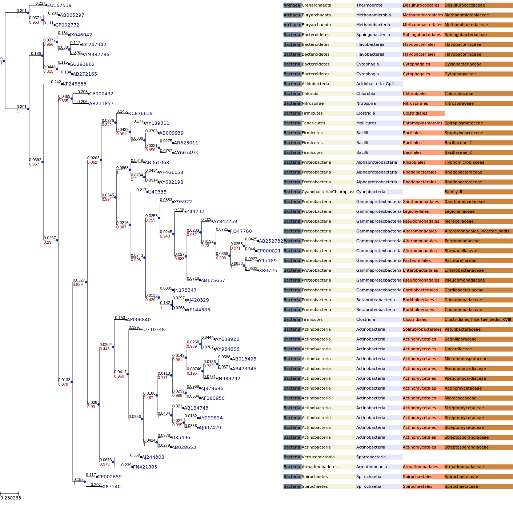

### Project Description

This project will analyze and visualize a tree constructed from [rdp 16s database](https://www.drive5.com/sintax/rdp_16s_v16.fa.gz).

#### Input file

**rdp_16s_v16_reads_50.fa**: Random 50 reads from [rdp 16s database](https://www.drive5.com/sintax/rdp_16s_v16.fa.gz)

#### Tools need

**[reformat.sh](https://jgi.doe.gov/data-and-tools/bbtools/bb-tools-user-guide/reformat-guide/)**:  This will pick 50 random reads from [rdp 16s database](https://www.drive5.com/sintax/rdp_16s_v16.fa.gz).

**[ETE Toolkit](http://etetoolkit.org/docs/latest/index.html)**: Analysis and visualization of trees.

#### Commands

```bash
# Download 16s rdp database

wget https://www.drive5.com/sintax/rdp_16s_v16.fa.gz
# Select only 50 random reads
reformat.sh in=rdp_16s_v16.fa.gz out=rdp_16s_v16_reads_50.fa sample=50 overwrite=true

```


Align the reads and build the tree using ETE Toolkit

Clean the fasta file


```bash
%%bash 
sed  -ie 's/\"//g'  rdp_16s_v16_reads_50.fa
sed 's/;/,/' rdp_16s_v16_reads_50.fa | sed 's/tax=//'| sed 's/:/_/g' | sed 's/_[^~]*\,d/,d/' | sed 's,;,,' > rdp_16s_v16_reads_50_clean.fa
grep ">" rdp_16s_v16_reads_50_clean.fa  | sed 's/,/ /'| sed 's/>//' >fasta_headers.txt
sed -ie 's/,.*//' rdp_16s_v16_reads_50_clean.fa
```


```bash
%%bash
ete3 build -w standard_fasttree -n  rdp_16s_v16_reads_50_clean.fa  -o ./rdp_16s_tree --clearall
```


### Display tree 


```python
from IPython.display import Image
Image(filename='rdp_16s_tree/clustalo_default-none-none-fasttree_full/rdp_16s_v16_reads_50_clean.fa.final_tree.png')
```


### Display tree with Alignment


```python
from ete3 import PhyloTree,  TreeStyle
tree1 = PhyloTree("rdp_16s_tree/clustalo_default-none-none-fasttree_full/rdp_16s_v16_reads_50_clean.fa.final_tree.nw")
tree1.link_to_alignment("rdp_16s_tree/clustalo_default-none-none-fasttree_full/rdp_16s_v16_reads_50_clean.fa.final_tree.used_alg.fa")
#tree1.render(file_name="rdp_alignment_tree.png", dpi=300 , w=1600, h=1000 )
tree1.render("%%inline", h=150, units="mm", dpi=100)
```


```python
# Read the headers to annotate the tree

with open("./fasta_headers.txt", "r") as f:
    headers=f.read().splitlines()
```


```python
# Create the database of headers
header_dict={}

# Function to replace characters

def remove_level_identification_char(string):
    # This will remove taxa level identification character
    
    if string.startswith("d_"):
        return {0:string.replace("d_", "")}
    elif string.startswith("p_"):
        return {1:string.replace("p_", "")}
    elif string.startswith("c_"):
        return {2:string.replace("c_", "")}
    elif string.startswith("o_"):
        return {3:string.replace("o_", "")}
    elif string.startswith("f_"):
        return {4:string.replace("f_", "")}
    elif string.startswith("g_"):
        return {5:string.replace("g_", "")}
    
        

for item in headers:
    #temp dictionary to hold taxa
    temp={}
    node,taxa=item.split()
    level_seperated =  taxa.split(",")[:-1]
    for  i in level_seperated:
        if temp:
            temp.update(remove_level_identification_char(i))
        else:
            temp=remove_level_identification_char(i)
            
        
    header_dict[node]=temp

```

[Colour Palatte is here.](http://etetoolkit.org/docs/latest/reference/reference_treeview.html#color-names)


```python
colour_palatte={0:"#708090", 1:"#F5F5DC", 2:"#E6E6FA", 3:"#FFA07A", 4:"#CD853F", 5:"#F08080"}
```


```python
def custom_layout(node):
    if node.is_leaf():
        # Add an static face that handles the node name
        faces.add_face_to_node(nameFace, node, column=0)
        lineage =  header_dict[node.name]
        for key, level in lineage.items():
            longNameFace = faces.TextFace(level+" ", fsize=8, fgcolor= "Black")
            longNameFace.background.color = colour_palatte[key]
            faces.add_face_to_node(longNameFace, node, column=key,  aligned=True)
            
```


```python
from ete3 import Tree, faces, TreeStyle
nameFace = faces.AttrFace("name", fsize=10, fgcolor="#191970")
ts = TreeStyle()
ts.show_leaf_name = False
ts.show_branch_length=True
ts.show_branch_support = True
ts.layout_fn = custom_layout
tree1.render("%%inline", tree_style=ts)
```





```python

```
